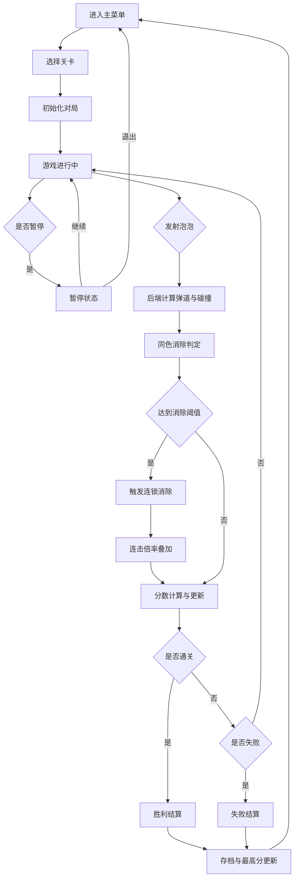

## 1. 产品概述

经典泡泡龙H5游戏，玩家通过发射彩色泡泡，使3个或以上同色泡泡相连并消除，获得分数通关。游戏采用前后端分离架构，前端负责画面渲染与用户交互，后端负责核心游戏逻辑与数据持久化。

- 主要用途：休闲益智类H5游戏，提供经典泡泡龙玩法体验
- 目标用户：休闲游戏玩家，喜欢益智消除类游戏的用户
- 产品价值：提供玩法丰富、规则严谨的泡泡龙游戏体验

## 2. 核心功能

### 2.1 功能模块
1. **主菜单页面**：开始游戏、关卡选择、最高分记录、游戏设置
2. **游戏主界面**：泡泡战场、发射器、瞄准线、分数面板、倒计时、剩余球数
3. **暂停/结算弹窗**：暂停菜单、胜利/失败结算、分数展示
4. **关卡选择页面**：关卡列表、难度标识、解锁状态

### 2.2 页面详情

| 页面名称 | 模块名称 | 功能描述 |
|---------|---------|----------|
| 主菜单 | 标题区 | 游戏Logo、动画标题 |
| 主菜单 | 按钮区 | 开始游戏、关卡选择、最高分 |
| 主菜单 | 设置区 | 音效开关、操作说明 |
| 游戏界面 | 泡泡战场 | Canvas渲染的六边形泡泡网格 |
| 游戏界面 | 发射器 | 当前泡泡、下一个泡泡预览 |
| 游戏界面 | 瞄准系统 | 鼠标/触摸瞄准、弹道轨迹预览 |
| 游戏界面 | HUD面板 | 分数、关卡、连击倍率、剩余球数 |
| 游戏界面 | 倒计时器 | 限时关卡倒计时显示 |
| 游戏界面 | 道具栏 | 可用道具展示与使用 |
| 关卡选择 | 关卡网格 | 关卡编号、星级评价、解锁状态 |
| 结算弹窗 | 结果展示 | 胜利/失败、最终分数、关卡奖励 |
| 暂停弹窗 | 暂停菜单 | 继续游戏、重新开始、返回主菜单 |

## 3. 核心流程

## 4. 用户界面设计

### 4.1 设计风格
- **主色调**：深邃太空蓝 (#0F0C29) 渐变至霓虹紫 (#302B63)
- **强调色**：泡泡使用糖果色系 - 红(#FF6B6B)、蓝(#4ECDC4)、黄(#FFE66D)、绿(#95E774)、紫(#C44DFF)、橙(#FF9F43)
- **UI风格**：玻璃拟态 (Glassmorphism) + 霓虹发光效果
- **按钮风格**：圆角矩形，发光边框，悬停放大动画
- **字体**：展示字体使用 Press Start 2P (复古像素风)，正文使用 Quicksand
- **布局风格**：游戏区居中，HUD环绕布局，响应式适配移动端

### 4.2 页面设计概览

| 页面名称 | 模块名称 | UI元素 |
|---------|---------|--------|
| 主菜单 | 标题区 | 发光动画Logo，浮动泡泡装饰，粒子背景 |
| 主菜单 | 按钮区 | 玻璃拟态按钮，霓虹边框，按压缩放效果 |
| 游戏界面 | 泡泡战场 | 六边形网格布局，泡泡消除爆炸动画，掉落物理效果 |
| 游戏界面 | 发射器 | 圆形发射器底座，当前泡泡居中，下一个泡泡侧边预览 |
| 游戏界面 | 瞄准系统 | 虚线弹道轨迹，终点高亮标记，墙壁反弹路径 |
| 游戏界面 | HUD面板 | 半透明玻璃卡片，发光数字，连击倍率动态特效 |
| 关卡选择 | 关卡网格 | 卡片式布局，星级展示，锁定/解锁状态图标 |
| 结算弹窗 | 结果展示 | 奖杯/遗憾图标，分数滚动动画，按钮动效 |

### 4.3 响应式设计
- 桌面端优先，Canvas自适应容器尺寸
- 移动端触摸操作支持，按钮最小触摸区域 48x48px
- 横竖屏自适应，横屏时HUD水平分布，竖屏时垂直分布

### 4.4 动画与特效
- 泡泡发射：加速运动轨迹
- 泡泡消除：径向爆炸粒子效果，缩放消失
- 连击触发：屏幕震动 + 数字跳字动画
- 关卡通关：烟花粒子爆发特效
- 道具使用：全屏闪光特效
