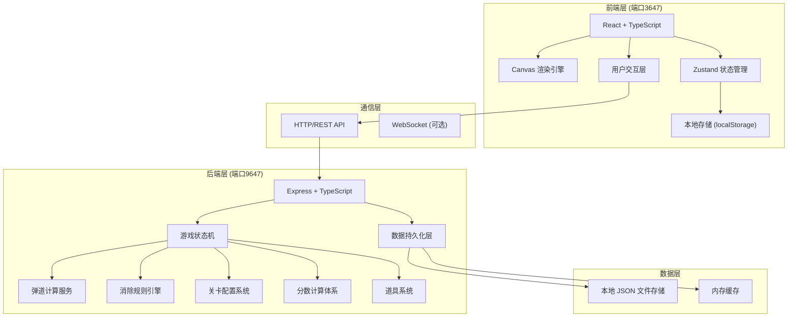
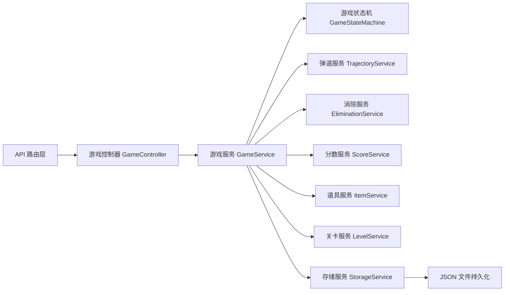
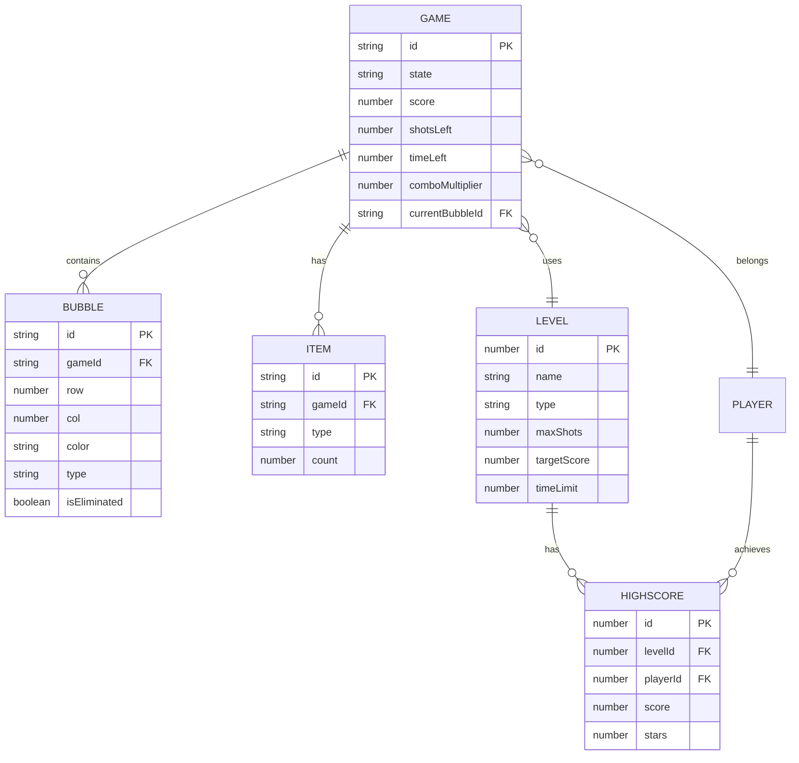

## 1. 架构设计



## 2. 技术说明

- **前端框架**：React@18 + TypeScript + Vite
- **UI样式**：TailwindCSS@3
- **状态管理**：Zustand
- **渲染引擎**：HTML5 Canvas 2D
- **后端框架**：Express@4 + TypeScript
- **数据存储**：本地 JSON 文件（游戏数据独立持久化）
- **通信协议**：HTTP REST API
- **前端端口**：3647
- **后端端口**：9647

## 3. 路由定义

| 路由 | 用途 |
|-----|------|
| / | 主菜单页面 |
| /levels | 关卡选择页面 |
| /game/:levelId | 游戏主界面 |

## 4. API 定义

### 4.1 游戏控制 API

```typescript
// POST /api/game/init - 初始化新游戏
interface InitGameRequest {
  levelId: number;
  playerId?: string;
}

interface InitGameResponse {
  gameId: string;
  levelId: number;
  bubbles: Bubble[][];
  currentBubble: Bubble;
  nextBubble: Bubble;
  score: number;
  shotsLeft: number;
  timeLeft?: number;
  targetScore: number;
  gameState: 'READY' | 'PLAYING';
}

// POST /api/game/aim - 计算弹道轨迹
interface CalculateTrajectoryRequest {
  gameId: string;
  angle: number;
  power: number;
}

interface CalculateTrajectoryResponse {
  trajectory: Point[];
  collisionPoint?: Point;
  targetBubble?: Bubble;
  willBounce: boolean;
  bounceCount: number;
}

// POST /api/game/shoot - 发射泡泡
interface ShootBubbleRequest {
  gameId: string;
  angle: number;
  power: number;
}

interface ShootBubbleResponse {
  gameId: string;
  newBubble: Bubble;
  landedPosition: { row: number; col: number };
  eliminatedBubbles: Bubble[];
  chainReaction: ChainElimination[];
  comboMultiplier: number;
  scoreGained: number;
  totalScore: number;
  shotsLeft: number;
  timeLeft?: number;
  fallingBubbles?: Bubble[];
  gameState: 'PLAYING' | 'WIN' | 'LOSE' | 'PAUSED';
  message?: string;
}

// POST /api/game/pause - 暂停游戏
interface PauseGameRequest {
  gameId: string;
}

interface PauseGameResponse {
  gameId: string;
  gameState: 'PAUSED';
  savedAt: number;
}

// POST /api/game/resume - 恢复游戏
interface ResumeGameRequest {
  gameId: string;
}

interface ResumeGameResponse {
  gameId: string;
  gameState: 'PLAYING';
  bubbles: Bubble[][];
  currentBubble: Bubble;
  nextBubble: Bubble;
  score: number;
  shotsLeft: number;
  timeLeft?: number;
  comboMultiplier: number;
}

// POST /api/game/restart - 重新开始
interface RestartGameRequest {
  gameId: string;
}

// GET /api/game/:gameId - 获取游戏状态（断线重连）
interface GetGameStateResponse {
  gameId: string;
  levelId: number;
  gameState: 'READY' | 'PLAYING' | 'PAUSED' | 'WIN' | 'LOSE';
  bubbles: Bubble[][];
  currentBubble: Bubble;
  nextBubble: Bubble;
  score: number;
  shotsLeft: number;
  timeLeft?: number;
  targetScore: number;
  comboMultiplier: number;
  availableItems: Item[];
  lastUpdated: number;
}
```

### 4.2 数据类型定义

```typescript
interface Bubble {
  id: string;
  row: number;
  col: number;
  x: number;
  y: number;
  color: 'red' | 'blue' | 'yellow' | 'green' | 'purple' | 'orange';
  type: 'normal' | 'obstacle' | 'locked' | 'bomb' | 'colorful';
  isEliminated?: boolean;
  isFalling?: boolean;
  lockHits?: number;
}

interface Point {
  x: number;
  y: number;
}

interface ChainElimination {
  level: number;
  bubbles: Bubble[];
  score: number;
}

interface Item {
  id: string;
  type: 'bomb' | 'range' | 'color_change';
  name: string;
  count: number;
  effect: {
    range: number;
    targetColor?: string;
  };
}

interface LevelConfig {
  id: number;
  name: string;
  type: 'normal' | 'timed' | 'obstacle';
  rows: number;
  cols: number;
  bubbleLayout: (string | null)[][];
  maxShots: number;
  targetScore: number;
  timeLimit?: number;
  specialBubbles: {
    obstacle?: number;
    locked?: number;
    bomb?: number;
  };
  availableColors: string[];
}

interface HighScore {
  levelId: number;
  score: number;
  stars: number;
  achievedAt: number;
}
```

### 4.3 道具 API

```typescript
// POST /api/game/item/use - 使用道具
interface UseItemRequest {
  gameId: string;
  itemType: 'bomb' | 'range' | 'color_change';
  targetBubbleId?: string;
  targetColor?: string;
}

interface UseItemResponse {
  gameId: string;
  itemType: string;
  eliminatedBubbles: Bubble[];
  scoreGained: number;
  totalScore: number;
  remainingItems: Item[];
  gameState: 'PLAYING' | 'WIN' | 'LOSE';
}

// GET /api/game/:gameId/items - 获取可用道具
```

### 4.4 数据管理 API

```typescript
// GET /api/levels - 获取所有关卡配置
interface GetLevelsResponse {
  levels: LevelConfig[];
  unlockedLevelIds: number[];
  highScores: HighScore[];
}

// GET /api/scores/high - 获取最高分
interface GetHighScoresResponse {
  highScores: HighScore[];
  totalScore: number;
}

// POST /api/scores/save - 保存分数
interface SaveScoreRequest {
  levelId: number;
  score: number;
  stars: number;
  gameId: string;
}
```

## 5. 服务端架构图



## 6. 数据模型

### 6.1 实体关系图



### 6.2 存储结构

```
data/
  ├── games/
  │   └── {gameId}.json        # 单局游戏存档
  ├── scores/
  │   └── highscores.json      # 最高分记录
  └── levels/
      └── levels.json          # 关卡配置
```

## 7. 游戏核心逻辑算法

### 7.1 六边形网格坐标系统
- 采用奇数行偏移 (odd-r) 布局
- 每个泡泡的邻居坐标计算

### 7.2 弹道计算
- 向量数学计算弹道轨迹
- 墙壁反弹物理模拟
- 泡泡圆形碰撞检测

### 7.3 消除判定
- BFS 广度优先搜索同色连通分量
- 消除阈值 >= 3 个相连
- 悬空泡泡检测与掉落
- 连锁消除递归处理

### 7.4 状态机定义
```
READY → PLAYING → PAUSED → PLAYING
PLAYING → WIN
PLAYING → LOSE
PAUSED → WIN
PAUSED → LOSE
```

## 8. 异常处理机制

- 恶意重复点击：请求节流，300ms 内同一操作只执行一次
- 非法指令：参数校验，状态机状态校验
- 断线重连：游戏数据每 5 秒自动存档，通过 gameId 恢复状态
- 数据一致性：版本号机制，防止过期请求覆盖新数据
